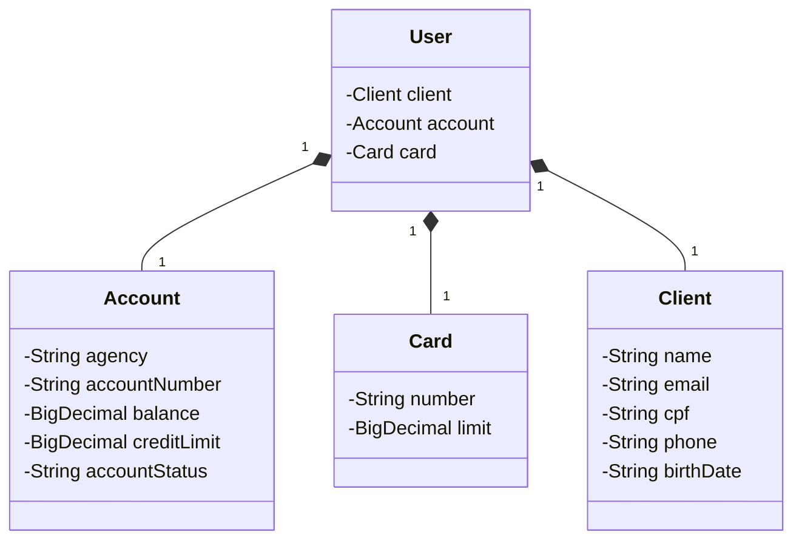

# Projeto.API-Banco

projeto feito para consolidar conhecimentos em API REST e Spring

## Diagrama


## Como usar
Para vizualizar o uso da API é possivel realizar isso das seguintes formas:
### Por meio do H2-Console (A memória dele é temporaria, então quando o programa for fechado todos os dados serão deletados)
1. Na IDE Altere a Run Configuration para que tenha:
   * Variable: SPRING_PROFILES_ACTIVE
   * Value: dev
2. Abra o Link: http://localhost:8080/h2-console
3. Confirme os seguintes dados:
    * JDBC URL: jdbc:h2:mem:bancoapi
    * User name: bancoapi
4. Abra o Link: http://localhost:8080/swagger-ui/index.html
5. Para utilizar o swagger siga os passos em [Exemplos para os usos do Swagger](#exemplos-para-os-usos-do-swagger)
    * [POST](#post)
    * [GET](#get)
6. Com tudo feito já é possivel utilizar os métodos e monitorar o banco de dados no H2

### Por meio de um banco de dados local (Foi utilizado o XAMPP)
1. Na IDE Altere a Run Configuration para que tenha:
   * Variable: SPRING_PROFILES_ACTIVE
   * Value: prd
2. Inicie o banco de dados local
3. confirme no banco de dados as seguintes informações
   * Existência do banco de dados "test"
   * Confirme se o username é "root"
   * Confirme se não existe senha
4. Abra o Link: http://localhost:8080/swagger-ui/index.html
5. Para utilizar o swagger siga os passos em [Exemplos para os usos do Swagger](#exemplos-para-os-usos-do-swagger)
    * [POST](#post)
    * [GET](#get)
6. Com tudo feito já é possivel utilizar os métodos e monitorar o banco de dados

## Exemplos para os usos do Swagger

### POST
```json
{
  "client": {
    "name": "Pedro",
    "email": "pedro@gmail.com",
    "cpf": "987.654.321-01",
    "phone": "(11) 94568-8965",
    "birthDate": "2000-06-16"
  },
  "account": {
    "agency": "0001",
    "number": "00000001-1",
    "balance": 257.5,
    "creditLimit": 120,
    "accountStatus": "Ativa"
  },
  "card": {
    "number": "0000-0000-0000-0001",
    "limit": 100
  }
}
```

### GET
Coloque apenas o Id que deseja consultar
