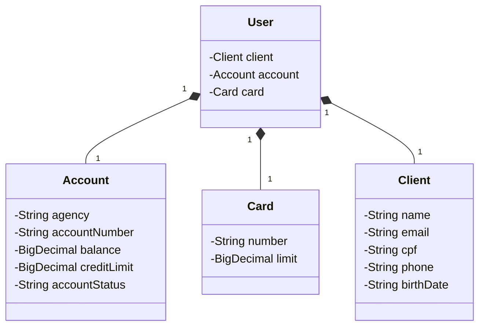

# Projeto.API-Banco

projeto feito para consolidar conhecimentos em API REST e Spring

## Diagrama

```mermaid
classDiagram

    class User {
        -Client client
        -Account account
        -Card card
    }

    class Client {
        -String name
        -String email
        -String cpf
        -String phone
        -String birthDate
    }

    class Account {
        -String agency
        -String accountNumber
        -BigDecimal balance
        -BigDecimal creditLimit
        -String accountStatus
    }

    class Card {
        -String number
        -BigDecimal limit
    }

    User "1" *-- "1" Account 
    User "1" *-- "1" Card
    User "1" *-- "1" Client


```
